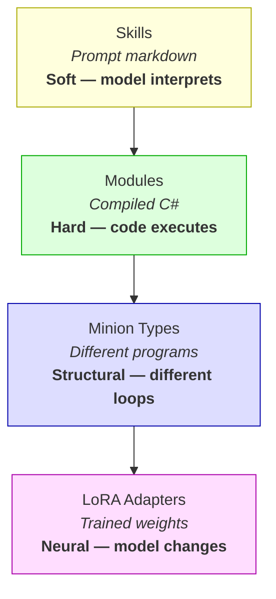
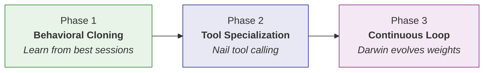
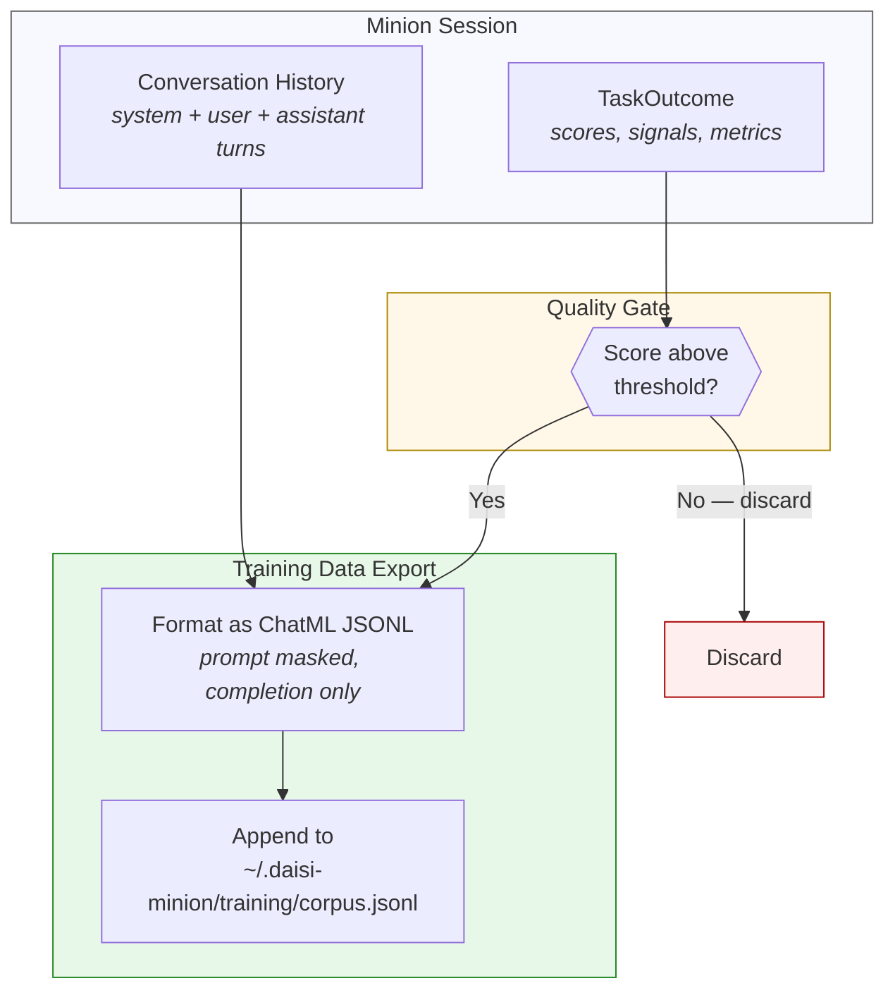
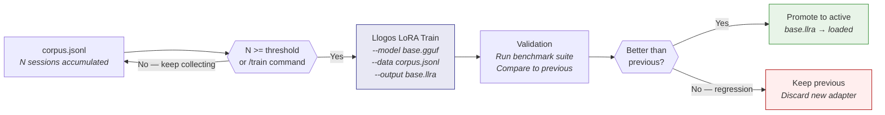
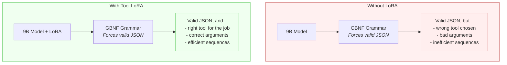
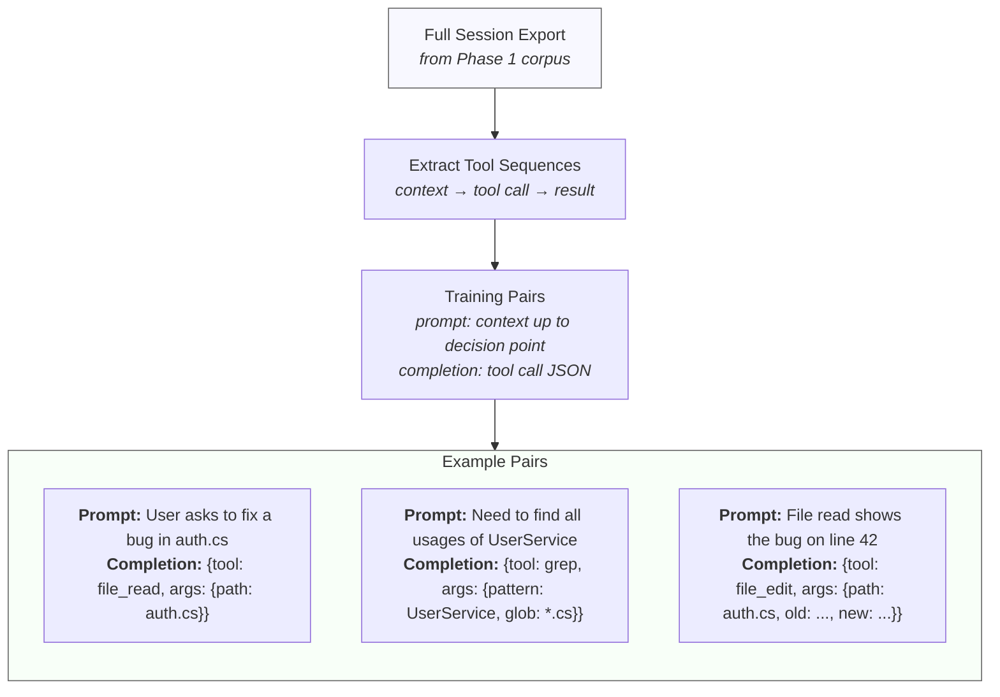
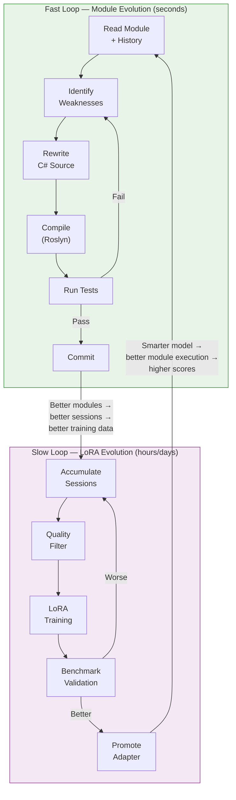
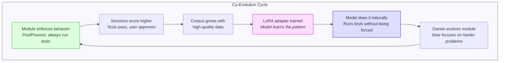
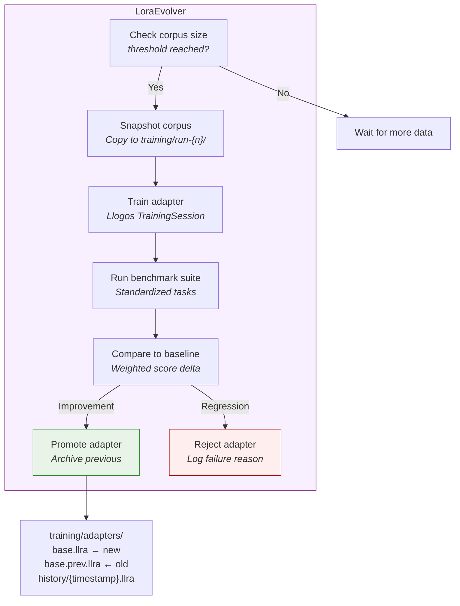
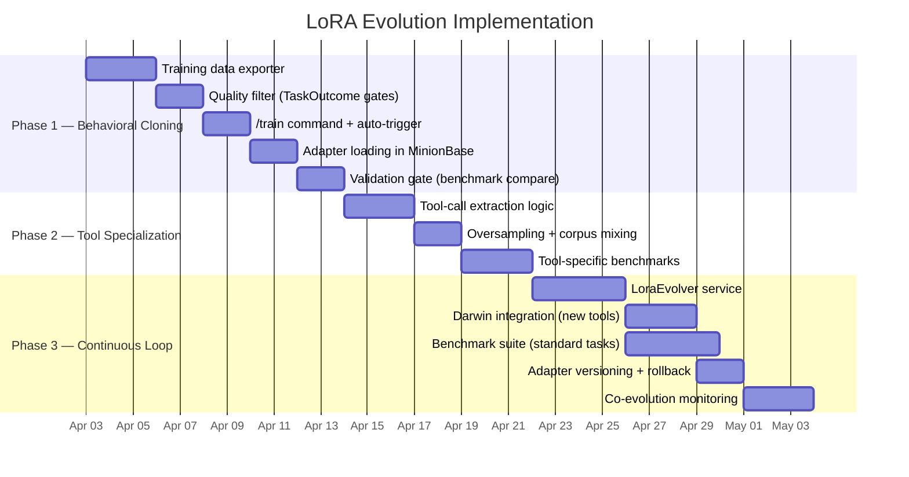

# Experiment: LoRA Evolution

**Status**: Design phase
**Depends on**: [Self-Evolving Minions](self-evolving-minions.md), [Daisi Llogos Training](../../../daisi-llogos/src/dotnet/Daisi.Llogos.Training/)

## Problem

The self-evolving minion system has two layers of hard differentiation: **modules** (compiled C# that executes deterministically) and **minion types** (structurally different programs). Both improve what happens *around* the model. But the model itself — the thing doing the actual reasoning, tool selection, and code generation — never changes. It's a static GGUF file.

A Qwen3.5-9B model that struggles with multi-step tool calling on day one will struggle identically on day one hundred, even after Darwin has evolved brilliant modules around it. The modules compensate for model weaknesses but never fix them.

LoRA (Low-Rank Adaptation) changes this. Daisi Llogos now supports native LoRA training with GPU acceleration — training a rank-8 adapter on a 9B model takes ~30 seconds on an RTX 5080. This is fast enough to close the loop: minions can evolve their own model weights.

## The Four Layers

LoRA adds a fourth layer beneath everything else — the deepest form of differentiation:



| Layer | Mechanism | What Improves | Speed to Change |
|-------|-----------|---------------|-----------------|
| Skills | Prompt text | What the model is told | Instant (swap text) |
| Modules | Compiled C# | What happens around the model | Seconds (Roslyn compile) |
| Types | Different code paths | How the agentic loop works | Manual (code change) |
| **LoRA** | **Trained weights** | **How the model thinks** | **~30 seconds (GPU training)** |

## Approach

Three capabilities, built incrementally. Each one is useful on its own and each one enables the next.



---

## Phase 1: Behavioral Cloning

**Goal**: Train adapters on the minion's own high-quality sessions — teach the model to behave more like its best self.

### Data Pipeline

Every minion session already produces two things:
1. **Conversation history** — the full chat (system prompt, user messages, assistant responses with tool calls)
2. **TaskOutcome** — scored metrics (succeeded, tests passed, tokens used, user approved, etc.)

The missing piece is a **training data exporter** that converts high-scoring sessions into Llogos-compatible JSONL.



### Quality Criteria

Not all sessions are worth learning from. The filter uses signals already captured in `TaskOutcome`:

| Signal | Requirement | Why |
|--------|-------------|-----|
| `Succeeded` | `true` | Only learn from completed tasks |
| `TestsPass` | `true` or `null` | Never learn from sessions that broke tests |
| `UserReverted` | `false` or `null` | User didn't undo the work |
| `ContextUtilization` | `< 0.8` | Sessions that hit compaction are noisy |
| `WasStopped` | `false` | Session wasn't interrupted |
| `SelfScore` | `>= 0.6` | Module's own assessment was positive |

Sessions that pass all gates are exported. Sessions that fail are discarded — they're anti-examples that would teach the model bad habits.

### Training Data Format

Llogos training accepts ChatML-formatted JSONL and automatically masks prompt tokens (system + user turns), training only on assistant completions. This is exactly what we want — the model learns to produce better *responses*, not to generate better *prompts*.

```json
{"text": "<|im_start|>system\nYou are a coding assistant...<|im_end|>\n<|im_start|>user\nFix the null reference in UserService.cs<|im_end|>\n<|im_start|>assistant\nLet me read the file first.\n\n{\"tool\": \"file_read\", \"args\": {\"path\": \"UserService.cs\"}}\n...<|im_end|>"}
```

The Llogos tokenizer detects the `<|im_start|>assistant\n` boundary and masks everything before it. Loss is computed only on the assistant's tokens — the model learns to produce good completions given the context.

### Training Trigger

Training runs on-demand via a new `/train` slash command or automatically when the corpus reaches a configurable threshold (e.g., 50 sessions):

```
~/.daisi-minion/
  training/
    corpus.jsonl          ← accumulated high-quality sessions
    adapters/
      base.llra           ← current active adapter
      base.prev.llra      ← previous adapter (rollback)
```



### Config Extension

New fields in `MinionConfig`:

```json
{
  "lora_adapter": "~/.daisi-minion/training/adapters/base.llra",
  "training_auto": true,
  "training_threshold": 50,
  "training_rank": 8,
  "training_alpha": 16,
  "training_epochs": 3,
  "training_lr": 1e-4,
  "training_seq_len": 512
}
```

### What This Buys

The model learns from its own best work. After 50+ high-quality sessions of tool-assisted coding, the adapter captures patterns like:
- Read the file *before* trying to edit it
- Use grep to find the right file instead of guessing paths
- Run tests after making changes
- Produce well-formed tool call JSON on the first try

These behaviors were previously enforced only via system prompt (soft, model-dependent). With a trained adapter, they become part of the model's weights (hard, reliable).

---

## Phase 2: Tool-Call Specialization

**Goal**: Train a focused adapter specifically on tool calling patterns — the single highest-impact area for a 9B model.

### Why Tool Calling Is the Bottleneck

A 9B model running locally faces a fundamental tension: it must simultaneously reason about what to do *and* format a precise JSON structure. Even with GBNF grammar constraining the output structure, the model still needs to:

1. Choose the right tool (file_read vs grep vs shell_execute)
2. Construct correct arguments (valid paths, proper regex, reasonable commands)
3. Use tools in efficient sequences (don't read 20 files when grep finds the answer)

Grammar constrains *syntax*. LoRA improves *semantics*. Together, they're belt and suspenders.



### Specialized Training Data

Phase 1 exports full conversations. Phase 2 extracts just the **tool calling moments** — the decision points where the model chooses and invokes a tool.



### Two Adapters or One?

Two options, with different tradeoffs:

**Option A: Single merged adapter** — Train one adapter on both general sessions (Phase 1) and tool-specific pairs (Phase 2). Simpler. One `.llra` file. No switching overhead.

**Option B: Stacked adapters** — Separate `general.llra` and `tools.llra`, merged sequentially. Allows evolving tool calling independently from general behavior. More complex.

Recommendation: **Start with Option A.** Combine Phase 1 and Phase 2 data into a single training corpus with tool-call pairs oversampled 2-3x relative to general conversation. If tool calling needs to evolve faster than general behavior, split later.

### Extraction Logic

For each tool call in a successful session:

```
1. Take the conversation up to the point just before the tool call
2. That's the prompt (masked during training)
3. The tool call JSON is the completion (trained on)
4. Include the tool result and next assistant response as extended context
```

This teaches the model the full pattern: *given this context, produce this tool call, and here's what happens next*. The model learns not just *how* to format tool calls but *when* each tool is appropriate and *what arguments* work.

### Measuring Impact

Tool calling quality is directly measurable from `TaskOutcome`:

| Metric | Target Direction | What It Measures |
|--------|-----------------|------------------|
| `ToolCalls` per task | Lower | Fewer wasted/redundant calls |
| `IterationsUsed` per task | Lower | Fewer retry loops from bad tool calls |
| `TotalTokens` per task | Lower | Less time recovering from errors |
| `Succeeded` rate | Higher | More tasks completed successfully |
| Grammar rejection rate | Lower | Fewer malformed tool call attempts |

Track these across adapter generations to measure real improvement.

---

## Phase 3: Continuous Learning Loop

**Goal**: Wire LoRA training into Darwin's evolution cycle so the model improves automatically alongside modules.

### Two Loops, One System

Darwin already runs a **fast loop** for modules: read → identify weakness → rewrite C# → compile → test → commit. This happens in seconds and produces deterministic improvements.

LoRA training is a **slow loop**: accumulate sessions → filter → train → validate → promote. This happens over hours/days and produces statistical improvements.

The two loops co-evolve. Modules get sharper. The model gets smarter. Each amplifies the other.



### The Co-Evolution Feedback Loop

This is the key insight: the two loops aren't independent. They feed each other.

1. **Darwin evolves a better module** (e.g., a post-processor that runs tests after every edit)
2. **Minion sessions with that module score higher** (tests catch regressions, user approves more)
3. **High-scoring sessions enter the training corpus** (filtered by TaskOutcome quality gate)
4. **LoRA trains on sessions where the module was active** (model learns patterns the module enforced)
5. **The model starts doing those things naturally** (runs tests without the module forcing it)
6. **Darwin can now evolve the module further** because the model handles the basics on its own

Over time, behaviors migrate from modules (explicit, deterministic) into the model (implicit, learned). Modules become scaffolding that can be simplified as the model internalizes their patterns.



### Darwin's New Tools

Darwin gains two new tools for the slow loop:

| Tool | Arguments | Description |
|------|-----------|-------------|
| `train_adapter` | `data_path`, `output_path`, `config` | Trigger Llogos LoRA training |
| `evaluate_adapter` | `adapter_path`, `benchmark_suite` | Run benchmark suite with a specific adapter loaded |

These integrate with Darwin's existing compile-test-validate pattern. Darwin can now evolve both code (modules) and weights (adapters).

### Orchestration

The slow loop is managed by a new `LoraEvolver` that mirrors `ModuleEvolver`:



### Benchmark Suite

The validation step runs a fixed set of tasks that cover key capabilities:

```
~/.daisi-minion/training/
  benchmarks/
    tool-calling/        ← tasks that test tool selection and args
    code-editing/        ← tasks that test multi-file edits
    research/            ← tasks that test read-only exploration
    reasoning/           ← tasks that test multi-step reasoning
```

Each benchmark task is a directory with:
- `task.md` — the goal to accomplish
- `workspace/` — the starting state (files to work with)
- `expected/` — success criteria (files that should exist, tests that should pass)
- `baseline.json` — previous best scores

The adapter must match or beat baseline scores across the suite to be promoted.

### Adapter Versioning

Every promoted adapter is archived with its training metadata:

```
~/.daisi-minion/training/
  adapters/
    base.llra               ← currently active
    base.prev.llra          ← one-step rollback
  history/
    2026-04-02T14-30-00.llra
    2026-04-02T14-30-00.json   ← { corpus_size, scores, config }
    2026-03-28T09-15-00.llra
    2026-03-28T09-15-00.json
```

This makes it possible to:
- Roll back if a promoted adapter causes problems in practice
- Track improvement over time
- Correlate adapter quality with corpus composition

### Safety Rails

LoRA evolution inherits the same core tenants as module evolution. The adapter can never bypass safety:

| Invariant | Enforcement |
|-----------|-------------|
| Tests must pass | Benchmark suite gates promotion |
| No regression allowed | Weighted score must meet or exceed baseline |
| Rollback always available | Previous adapter archived before promotion |
| Training data is auditable | Corpus is plain JSONL, human-readable |
| Model can't self-modify | Training runs as a separate process; model doesn't access its own weights |

The model being trained has no awareness that it's being trained. It completes tasks, those tasks are scored, and high-scoring sessions become training data. The model can't game the scoring because scoring happens after the session ends, using objective signals (tests pass, compilation succeeds, user approval) rather than model self-report alone.

---

## Implementation Sequence



## Constraints

- **Hardware**: RTX 5080 (16 GB VRAM). Training a rank-8 LoRA on Qwen3.5-9B fits in VRAM alongside the quantized base model.
- **Training time**: ~30 seconds per epoch on GPU. A 3-epoch training run takes ~90 seconds — fast enough to run as part of Darwin's loop.
- **Sequence length**: Default 512 tokens. Short enough for fast training, long enough for most tool call sequences. Can increase for general behavioral cloning if VRAM allows.
- **Adapter size**: A rank-8 adapter targeting attention + FFN across all layers is ~25 MB — trivial to store and version.
- **Base model**: Adapters are model-specific. Changing the base GGUF file invalidates all adapters. The training pipeline must detect model changes and reset.
