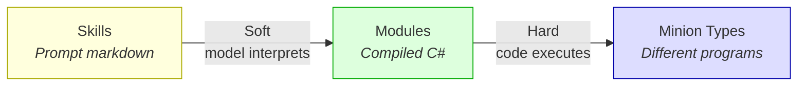
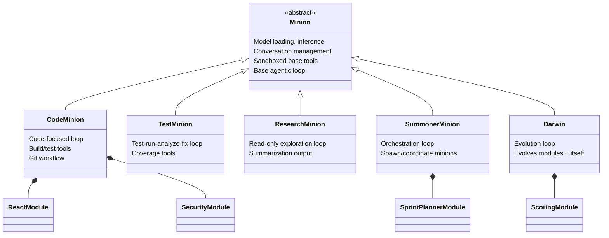
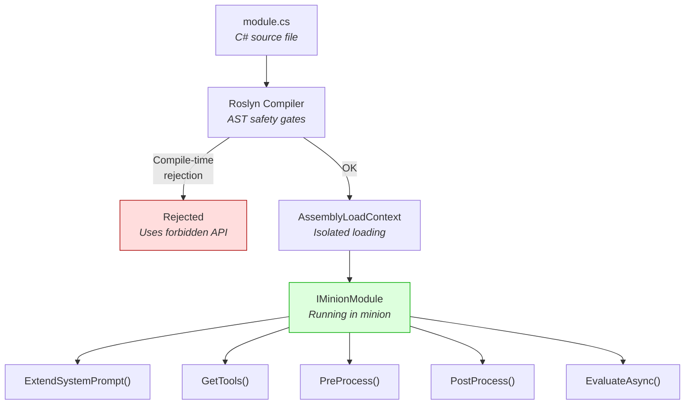
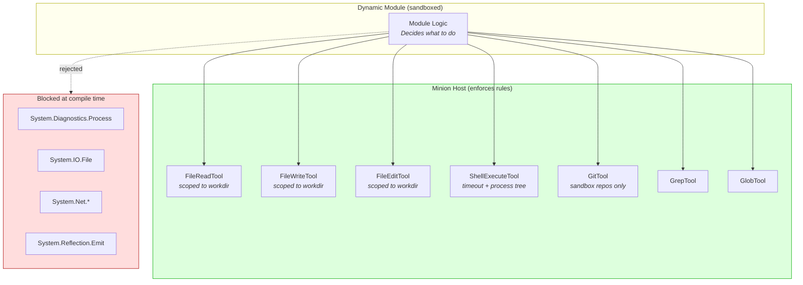
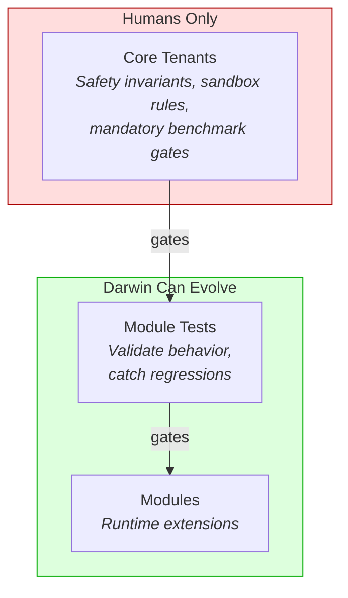
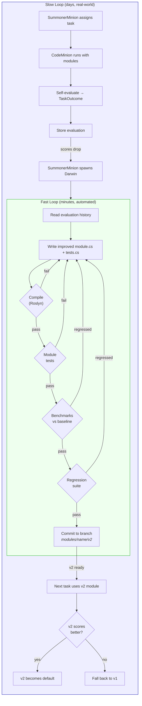
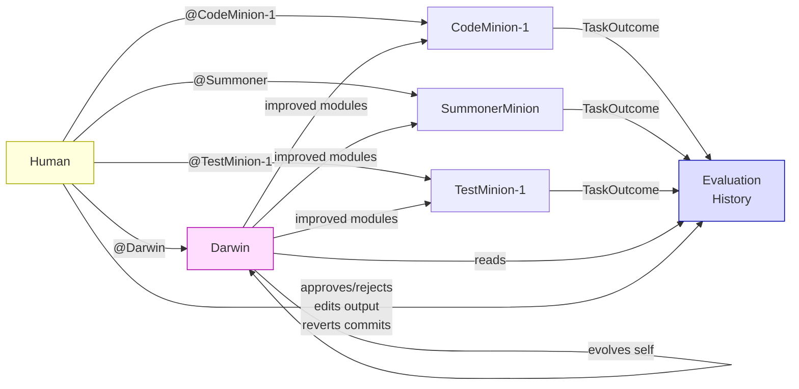
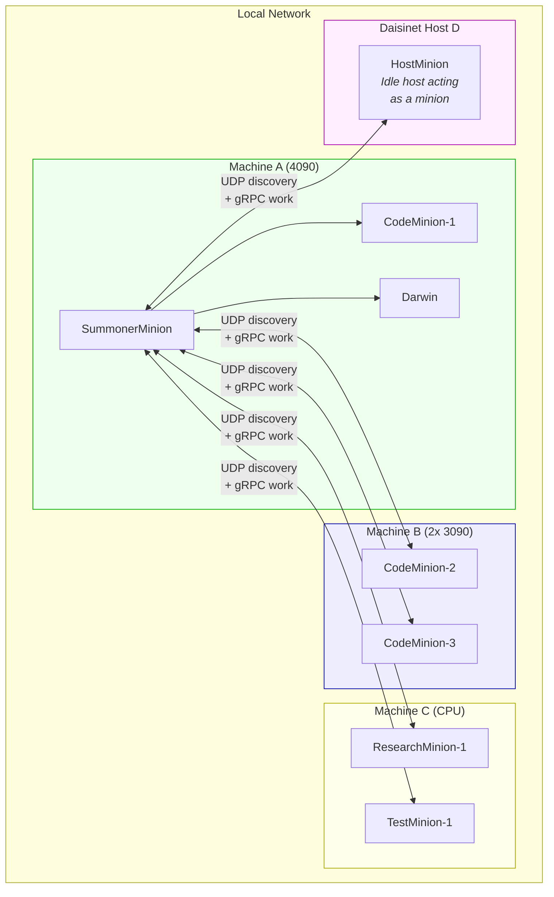
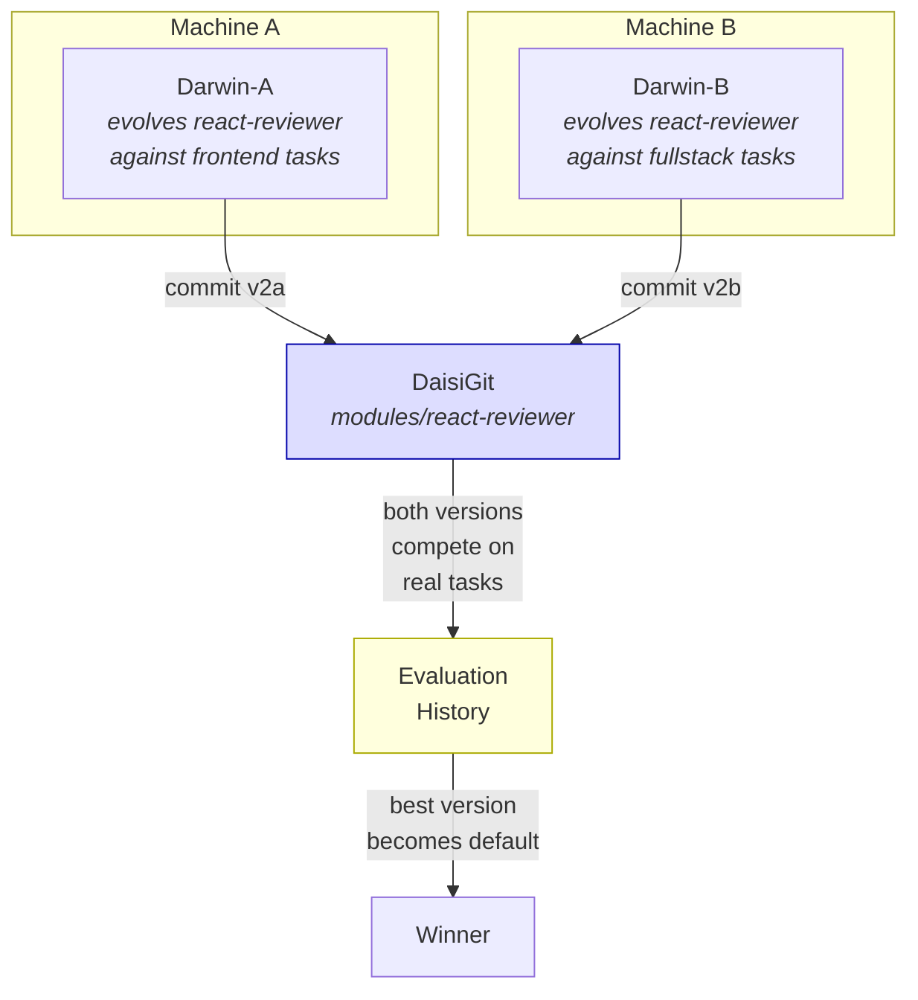

# Experiment: Self-Evolving Minions

**Status**: Design phase
**Inspired by**: [Meta Hyperagents](https://github.com/facebookresearch/Hyperagents) — self-referential self-improving agents that optimize via iterative code modification

## Problem

Today, minions are compiled once and never change. A `daisi-minion` binary is the same whether it's fixing a React bug or writing Terraform. Differentiation happens only at the prompt level — roles and personas swap system prompt text, but the actual code, tools, and agentic loop are identical.

Prompt-level differentiation (skills) is interpreted by the model. It's a suggestion, not a guarantee. A skill that says "always run tests after editing" depends on the model's willingness to follow that instruction. We need **hard-coded differentiation** — actual compiled C# that behaves differently depending on the task.

## Design

### Three Layers of Differentiation

| Layer | Mechanism | Reliability | Example |
|-------|-----------|-------------|---------|
| **Skills** | Prompt markdown | Model-dependent | "When reviewing, check for X..." |
| **Modules** | Compiled C# extensions | Deterministic | A post-processing hook that runs `dotnet test` after every edit |
| **Minion Types** | Different core programs | Fundamentally different | `CodeMinion` vs `TestMinion` vs `ResearchMinion` |

Skills are soft. Modules are hard. Minion types are structural.



### Minion Type Hierarchy



Each type inherits the base runtime but overrides what matters: which tools are registered, what the agentic loop looks like, how completion is detected, what evaluation means.

The existing `MinionEngine` is essentially the first `CodeMinion`. The refactoring extracts `Minion` as the base class.

### Dynamic Modules (Roslyn Compilation)

Modules are `.cs` source files compiled at runtime via Roslyn. A module implements `IMinionModule`:

```csharp
public interface IMinionModule
{
    string Name { get; }
    string Description { get; }

    // Lifecycle
    void Initialize(MinionModuleContext context);

    // Extension points
    string? ExtendSystemPrompt();
    IEnumerable<IMinionTool>? GetTools();
    string? PreProcess(string userInput);
    string? PostProcess(string response);
    Task<ModuleEvaluation> EvaluateAsync(TaskOutcome outcome);
}
```

Example — a module a local model could write:

```csharp
public class ReactCodeReviewer : IMinionModule
{
    public string Name => "react-reviewer";
    public string Description => "Specialized React code review";

    public void Initialize(MinionModuleContext context) { }

    public string? ExtendSystemPrompt() =>
        "When reviewing React code, check for: missing keys in lists, " +
        "stale closures in useEffect, unnecessary re-renders, " +
        "missing dependency arrays, and prop drilling that should use context.";

    public IEnumerable<IMinionTool>? GetTools() => null;

    public string? PreProcess(string input) => null;
    public string? PostProcess(string response) => null;

    public Task<ModuleEvaluation> EvaluateAsync(TaskOutcome outcome) =>
        Task.FromResult(new ModuleEvaluation
        {
            Score = outcome.UserApproved ? 1.0 : 0.3,
            Notes = outcome.UserApproved ? "Review accepted" : "Review rejected or ignored"
        });
}
```

Modules compose. A minion can load multiple:

```
spawn CodeMinion --modules react,security "Fix the XSS vulnerability in the login form"
```



### Sandboxed Tools as the Security Boundary

Dynamically compiled code is dangerous. The sandbox isn't "modules can't do dangerous things" — it's **"modules can only do dangerous things through supervised channels."**

The base `Minion` class provides hardcoded tools that cannot be overridden or removed:

```csharp
public abstract class Minion
{
    // Sealed — modules cannot override, remove, or bypass
    protected sealed FileReadTool FileRead { get; }
    protected sealed FileWriteTool FileWrite { get; }
    protected sealed FileEditTool FileEdit { get; }
    protected sealed ShellExecuteTool Shell { get; }
    protected sealed GitTool Git { get; }
    protected sealed GrepTool Grep { get; }
    protected sealed GlobTool Glob { get; }
}
```

Invariants enforced at the tool level, not the module level:

- **File tools**: Paths resolved and rejected if outside the minion's scoped working directory. No `../../etc/passwd`.
- **Shell tool**: All processes get timeouts, run in the scoped directory, and get process-tree cleanup on cancel or shutdown.
- **Git tool**: Operates only within the sandbox.

Roslyn compile-time gate: modules can only reference module SDK types (`IMinionTool`, `ToolResult`, `JsonObject`, basic collections). Direct use of `System.Diagnostics.Process`, `System.IO.File`, `System.Net`, or `System.Reflection.Emit` is rejected at compilation.

The module decides **what** to do. The host decides **how** it's allowed to happen.



### Isolation Progression

| Phase | Isolation | Trust Level |
|-------|-----------|-------------|
| **Local dev** | Roslyn AST gates + AssemblyLoadContext | You wrote it |
| **Summoner-generated** | + process isolation (restricted Windows token, named pipe comms) | LLM wrote it |
| **Marketplace** | + WASM sandbox (Wasmtime, capability-based) | Strangers wrote it |

## Core Tenants

Immutable rules that apply to every minion type, every module, every iteration. Hardcoded in the base `Minion` class. No evolution can touch them.

### Safety Invariants

- Must compile (Roslyn) before it can run
- Must not modify files outside the sandbox working directory
- Must not exceed the iteration budget
- Must not produce empty output
- Must always self-evaluate (cannot skip evaluation)
- Must not disable or weaken core tenant checks

### Performance Benchmarks

Measurable baselines that Darwin can run before and after every change. These are automated, fast, and require no human input:

| Benchmark | Measures |
|-----------|----------|
| Tokens per task | How much output to accomplish a goal |
| Iterations to completion | How many agentic loop cycles |
| Tool calls per task | Tool usage (thrashing vs thoroughness) |
| Time to first tool call | How quickly the minion starts acting vs overthinking |
| Context utilization at completion | How much context window was consumed |
| Module compilation time | Roslyn overhead |
| Module test pass rate | Does the module's own test suite pass |
| Regression suite pass rate | Does it still pass known-good cases |

### Weighted Scoring

Benchmarks can't be evaluated in isolation — they're interdependent and context-dependent. Fewer tool calls is usually better, but not if it means more iterations. Faster compilation is nice, but not if the module is trivially simple and useless. A SecurityModule that adds static analysis will always increase compilation time — that's the point.

Each module carries a `BenchmarkProfile` that assigns weights to each benchmark:

```csharp
public class BenchmarkProfile
{
    // Weights (-1.0 to 1.0): negative = lower is better, positive = higher is better
    public double TokensPerTask { get; set; }             // usually -0.3
    public double IterationsToCompletion { get; set; }    // usually -0.5
    public double ToolCallsPerTask { get; set; }          // context-dependent
    public double TimeToFirstToolCall { get; set; }       // usually -0.2
    public double ContextUtilization { get; set; }        // usually -0.3
    public double CompilationTime { get; set; }           // near zero for complex modules
    public double TestPassRate { get; set; }              // always +1.0 (core tenant)
    public double RegressionPassRate { get; set; }        // always +1.0 (core tenant)
}
```

Weights vary by context:

- **By minion type** — CodeMinion weights compilation success heavily. ResearchMinion doesn't compile anything, so that weight is zero and context utilization matters more.
- **By task complexity** — A one-file bug fix penalizes high tool call counts. A 20-file refactor expects them.
- **By module purpose** — A SecurityModule's compilation time weight is near zero because the added analysis pass is the point. Its weight for "caught real vulnerabilities" is high.

The profile lives with the module — Darwin can evolve it too. But core tenant constraints on the profile are immutable:

- `TestPassRate` and `RegressionPassRate` can never be weighted below `+1.0`
- The weighted score must always be computed (cannot be skipped)
- Test and regression pass rates are **mandatory gates** regardless of weighted score — a module that fails tests never ships, even if every other benchmark is stellar

This lets Darwin tune the tradeoffs between speed and thoroughness, but never tune away correctness.

Darwin runs benchmarks automatically. A module that regresses on its weighted score doesn't ship.

### Module Test Suite

Each module has co-located unit tests that evolve alongside it:

```
~/.daisi-minion/modules/
  react-reviewer/
    module.cs           ← the module source
    tests.cs            ← tests for this module (also compiled via Roslyn)
    benchmarks.json     ← BenchmarkProfile (weights, evolved by Darwin)
    evaluation.json     ← score history across real-world tasks
```

Tests are actual C# compiled via the same Roslyn pipeline, same sandbox:

```csharp
public class ReactReviewerTests : MinionModuleTests
{
    [TestCase("missing-key")]
    public async Task DetectsReactMissingKey()
    {
        // Given a React component with a list missing key props
        var input = LoadFixture("missing-key.tsx");

        // When the module reviews it
        var result = await RunModule(input, goal: "Review this component");

        // Then the output mentions missing keys
        Assert.That(result.Output, Contains("key"));
        Assert.That(result.Objective.CompileSuccess, Is.True);
        Assert.That(result.Benchmark.IterationsUsed, Is.LessThan(3));
    }
}
```

Darwin writes both module and tests. When it improves a module, it also updates the tests. When it writes a new module from scratch, it can write the tests first (TDD for minions).

Darwin's own modules have tests too. But there's a risk: Darwin could weaken its own tests to inflate scores. Core tenants are the immutable floor that prevents this.

### Trust Hierarchy

| Layer | Who writes it | Who can change it | Purpose |
|-------|--------------|-------------------|---------|
| **Core tenants** | Humans | Humans only | Safety invariants, benchmark definitions, sandbox rules |
| **Module tests** | Darwin | Darwin | Validate module behavior, catch regressions |
| **Modules** | Darwin | Darwin | The actual runtime extensions |

Core tenants gate everything. Module tests gate the module. Darwin evolves the bottom two layers but can never touch the top.



## The SummonerMinion

The summoner is just another minion type — not a special privileged process. It inherits the same base runtime but its loop is orchestration, not coding.

**Tools**: `spawn_minion`, `check_minion`, `stop_minion`, `task_board`, `message_minion` (not file_write, not shell)
**Loop**: Break goal into tasks → spawn typed minions with modules → monitor → merge results
**Evaluation**: Did the team deliver? Any merge conflicts? How many minions got stuck?

SummonerModules evolve like any other. A `SprintPlannerModule` that keeps causing file conflicts between CodeMinions can be improved by Darwin. A `PairProgrammingModule` that pairs two minions on the same problem for cross-checking is a different coordination strategy — both can be scored and compared.

The summoner is a lazy leader. It knows which types, modules, and versions exist and their scores. It picks the right combination for the job. It does not write code, evaluate quality, or improve anything — that's Darwin's job.

Who spawns the first SummonerMinion? The user directly, or a root-level one that's always running — TBD.

## The Evolution Loop

### Darwin (EvolutionMinion)

Darwin is a specialized minion type whose sole purpose is making other minions better — and making itself better.

Darwin:
- Reads evaluation results from completed tasks
- Analyzes patterns across many outcomes (not single tasks)
- Writes improved `.cs` module source files
- Tests the improvements (compiles, runs, evaluates)
- Can evolve itself — its own modules are subject to the same loop
- Commits improved versions to git branches
- Can evolve SummonerModules too — improving how work gets coordinated, not just how it gets done

### Evaluation Signals

Darwin looks at multiple layers of signal to determine what "better" means:

**Objective signals** — did the thing actually work?
- CodeMinion: did it compile? did tests pass? did git commit succeed?
- TestMinion: did it find real bugs? did coverage increase?
- SummonerMinion: did all spawned minions complete? any merge conflicts?

**User signals** — did the human approve?
- User accepts output, asks for changes, or rejects it
- User explicitly rates the result
- User has to redo the work themselves (strongest negative signal)

**Inferred signals** — what happened after?
- Did the user edit the minion's output? (partial failure)
- Did the user revert the commit? (full failure)
- Was the minion stopped before completion? (stuck or bad approach)
- How many iterations vs budget? (efficiency)

**Self-assessment** — the minion evaluates itself
- Retry count, files modified vs task scope, context utilization

```csharp
public class TaskOutcome
{
    // Objective
    public bool? CompileSuccess { get; set; }
    public bool? TestsPass { get; set; }
    public int? TestsAdded { get; set; }
    public int IterationsUsed { get; set; }
    public int IterationBudget { get; set; }
    public double ContextUtilization { get; set; }

    // User
    public bool? UserApproved { get; set; }
    public bool? UserEdited { get; set; }
    public bool? UserReverted { get; set; }

    // Inferred
    public int FilesModified { get; set; }
    public bool WasStopped { get; set; }
    public TimeSpan Duration { get; set; }

    // Self
    public double SelfScore { get; set; }
    public string? SelfNotes { get; set; }
}
```

Darwin doesn't look at single scores — it looks at patterns. "This module compiles 95% of the time but users edit the output 60% of the time. The code works but isn't what they want." That's a signal to improve the prompt or add a clarification step, not to change the build logic.

The scoring formula itself starts hardcoded (simple weighted average) but is eventually something Darwin can evolve too — its own evaluation of what matters most.

### The Cycle

Two loops — one fast (automated, minutes), one slow (real-world, days).

**Fast loop** (Darwin iterates alone, no humans, no real tasks):

```
1. Read evaluation history, identify weakness in a module
2. Write improved module.cs + tests.cs
3. Compile both (Roslyn) → fail? go to 2
4. Run module tests → fail? go to 2
5. Run performance benchmarks against baseline → regressed? go to 2
6. Run regression suite (known-good tasks) → regressed? go to 2
7. Commit to branch: modules/react-reviewer/v2
```

Steps 3-6 are fully automated. Darwin can iterate dozens of times in minutes. No humans, no real tasks, no expensive inference — just compilation, test execution, and benchmarks.

**Slow loop** (real-world validation):

```
1. SummonerMinion assigns task → CodeMinion + modules
2. CodeMinion runs, completes task
3. CodeMinion self-evaluates → TaskOutcome
4. Outcome stored alongside module version

    ... after N tasks with weak scores ...

5. SummonerMinion spawns Darwin:
   "The react-reviewer module scored 0.3 on the last 5 tasks.
    Here are the evaluation notes. Write an improved version."

6. Darwin runs the fast loop (above), produces v2

7. Next time SummonerMinion needs react review:
   - Sees v2 branch exists, passed fast loop
   - Spawns CodeMinion with v2 module on a real task
   - If v2 scores better over time, it becomes the default
   - If worse, SummonerMinion falls back to v1
```

The fast loop is cheap validation. The slow loop is expensive truth. Both are needed — the fast loop prevents obviously bad changes from wasting real-world cycles, and the slow loop catches subtle issues that only show up in practice.



### How This Maps to Hyperagents

| Hyperagent Concept | Minion Equivalent |
|---|---|
| Task Agent (stateless Python) | Working Minions (compiled C# types + modules) |
| Meta Agent (modifies task agent code) | Darwin (writes and tests new module source) |
| `archive.jsonl` (lineage + scores) | Git history + evaluation records |
| `model_patch.diff` | Git commits to module `.cs` files |
| Docker isolation per generation | Git branches per module version |
| Parent selection (best/latest/random) | SummonerMinion picks module version by score + trial status |
| Staged evaluation (cheap then full) | Quick compile test, then real task evaluation |

Key differences from Hyperagents:
- **Compiled, not patched** — modules are type-checked C#, not Python diffs. Bad code fails at compile time.
- **Git, not flat files** — full version history, branches, diffs, PRs, blame.
- **Composable** — multiple modules stack on a minion type. Hyperagents replaces the whole agent.
- **Humans in the loop** — marketplace review workflow already exists for publishing evolved modules.
- **Persistent identity** — minions remember across sessions. Hyperagents task agents are stateless.

## Storage Progression

| Phase | Where Modules Live | Sharing |
|-------|-------------------|---------|
| **Now** | `~/.daisi-minion/modules/` | Local only |
| **DaisiGit** | Per-account git repo | Team/org sharing via DaisiGit permissions |
| **Marketplace** | Published as marketplace items | Cross-account, reviewed, priced |

DaisiGit is the natural home because:
- Already partitioned by account in Cosmos DB
- REST API with bot tools (13 tools: ReadFile, BrowseFiles, CreatePR, etc.)
- Orgs + Teams for permission control
- Darwin can use DaisiGit tools to manage branches and PRs

## Human Interaction

Humans interact with minions the same way regardless of type — there's nothing special about talking to Darwin vs talking to a CodeMinion. The same interface, same mechanism, same `@` addressing.

### `@` Addressing

The `@` prefix routes a message to a specific minion by name. The TUI input handler parses the target, the mailbox/channel infrastructure delivers it, and the minion interprets it according to its type.

```
@Darwin "the code minion is too slow on large refactors"
@Darwin "show me what you've changed this week"
@Darwin "add a constitution rule: never delete test files"
@CodeMinion-1 "use explicit types, not var"
@CodeMinion-1 "stop, that's the wrong approach"
@Summoner "that task is too big for one minion, split it"
@TestMinion-1 "focus on edge cases, not happy paths"
```

Under the hood: `@Name message` → `SendMessage(to: "name", content: "message")` through the existing channel infrastructure. The minion receives it in its inbox and incorporates it into its next iteration.

### Interaction Modes

These apply to every minion type. The difference is what each type *does* with the input.

| Mode | Description | Example |
|------|-------------|---------|
| **Passive** | Minion works autonomously, human doesn't intervene | Darwin evolves modules in the background, things just get better |
| **Directive** | Human sends a message mid-task, minion adjusts | `@CodeMinion-1 "don't refactor, just fix the bug"` |
| **Review gate** | Minion proposes, human approves before it takes effect | Darwin: "Improved react-reviewer v1→v2, iterations -30%. Approve?" |
| **Retrospective** | Human asks any minion to explain what it did and why | `@Darwin "what did you change this week and what improved?"` |
| **Constitution** | Human sets rules that constrain behavior across all future tasks | `@Darwin "prioritize correctness over speed in all modules"` |

The human picks their comfort level. Early on, review gate for Darwin. As trust builds, passive with occasional retrospectives. Directives when the human has specific insight. Constitution always.

### Every Interaction Is Training Data

When a human corrects a CodeMinion mid-task, that's a signal Darwin can learn from. When a human overrides a SummonerMinion's task breakdown, that's a signal too. When a human approves or rejects a Darwin proposal, that directly feeds the evaluation loop.

Every `@` message, every approval, every rejection, every time the human redoes a minion's work — it all flows into `TaskOutcome` and shapes future evolution. The human doesn't need to explicitly rate things (though they can). Their actions are the rating.



## Future: Distributed Minions

Today all minions run on one machine. Long term, minions should run across multiple machines on a network — and eventually, Daisinet hosts themselves could act as minions.

The architecture already points in this direction. The SummonerMinion doesn't care if a CodeMinion is a local process or a machine across the room. It spawns, messages, and reads output through the same interface. The jump from local to distributed is transport, not architecture.

### Network Discovery

Minions announce themselves on the local network via UDP broadcast. A SummonerMinion (or any minion that needs to find peers) listens for announcements and builds a roster of available minions.



Discovery protocol:
- Each minion broadcasts a UDP announcement on a well-known port (e.g. every 30s)
- Announcement contains: minion type, available capacity (VRAM, context slots), loaded model, current status (idle/busy), auth token fingerprint
- Listeners build a live roster, evict stale entries after N missed heartbeats
- gRPC used for actual work (spawn, message, output streaming) once discovered

### Authentication

Minions on a network need mutual auth. Options that integrate with existing infrastructure:

- **Shared account key** — all minions on the network belong to the same Daisinet account. The account's client key is the trust anchor. Simple, works for single-user/team setups.
- **ORC-mediated auth** — minions register with the ORC, which issues session tokens. Peers verify tokens with the ORC. Works for multi-account setups.
- **mTLS** — each minion gets a certificate signed by the account's CA. Peers verify certs directly, no ORC dependency. Best for offline/air-gapped networks.

### Hardware-Aware Scheduling

A SummonerMinion that knows the network's hardware profile makes better decisions:

| Machine | Hardware | Best For |
|---------|----------|----------|
| Workstation (4090, 24GB) | Fast single-GPU inference | CodeMinion on complex tasks, Darwin's fast loop |
| Server (2x 3090, 48GB total) | Large models, parallel sessions | Multiple CodeMinions, big context windows |
| Laptop (CPU only) | Slow inference, always available | ResearchMinion, TestMinion (mostly tool execution, little inference) |
| Daisinet Host (idle) | Variable, opportunistic | Overflow work, background Darwin evolution |

The SummonerMinion doesn't need to be told this. It discovers capacity via the UDP announcements and learns which machines perform best for which task types through the evaluation loop. Over time, Darwin can evolve the SummonerModule's scheduling strategy based on real outcomes.

### Daisinet Hosts as Minions

The DualModeOrchestrator already has the concept of "idle → offer model to the network." This extends naturally: an idle Daisinet host doesn't just serve raw inference — it becomes a full minion with tools, modules, and an agentic loop.

- Host is busy serving inference to ORC consumers → normal host mode
- Host goes idle → spins up as a minion, announces itself on the network
- SummonerMinion discovers it, assigns background tasks (Darwin evolution, research, test runs)
- Host gets a real inference request from ORC → pauses minion work, serves the request, resumes

The minion work is interruptible because it's just conversation state. Save context, yield GPU, restore when idle again.

### Federated Evolution

Darwin instances running on different machines evolve the same modules independently against different workloads:



Machine A's Darwin improves react-reviewer based on frontend-heavy work. Machine B's Darwin improves it based on fullstack work. Both commit to DaisiGit branches. The SummonerMinion sees both versions, tries them on real tasks, and the best one wins. Natural selection across a population, not just a single lineage.

### Minion Migration

A long-running minion can be paused on one machine and resumed on another:

1. Save conversation state (history, file tracking, module state)
2. Serialize to a portable format
3. Transfer to target machine
4. Reload model (or reuse already-loaded model if compatible)
5. Restore conversation state
6. Resume from where it left off

Use cases:
- Machine A needs its GPU for a higher-priority task → migrate CodeMinion to Machine B
- User moves from desktop to laptop → their minion follows
- Load balancing — SummonerMinion migrates work toward idle capacity

The minion doesn't know it moved. From its perspective, it just had a brief pause.

### Swarm Coordination

Multiple SummonerMinions across machines can coordinate on large projects:

- **SummonerMinion-A** on Machine A owns the frontend feature
- **SummonerMinion-B** on Machine B owns the backend API
- They communicate via `@` addressing across the network
- Each spawns local workers on their own machine (or on discovered idle machines)
- They negotiate shared resources: "I need a CodeMinion with the big model for 10 minutes" / "OK, I'll pause my ResearchMinion"

This isn't a central controller — it's a federation of peers. No single point of failure. If Machine A goes offline, Machine B's summoner can pick up its incomplete tasks.

### `@` Addressing Across Machines

The `@` addressing system extends transparently to the network:

```
@Darwin "improve the react module"              → routed to Darwin wherever it's running
@Machine-B:CodeMinion-2 "use the v2 API"        → explicit machine targeting
@CodeMinion-* "stop and wait for new instructions" → broadcast to all CodeMinions
```

The routing layer resolves names against the discovery roster. Local minions are resolved immediately; remote minions are reached via gRPC. The sender doesn't need to know where the target is.

## Open Questions

1. **Module composition conflicts** — What happens when two modules both define `PostProcess`? Chain them? Priority order? Let the summoner decide?

2. **Evaluation quality** — Self-evaluation is only as good as the model doing the evaluating. Should the SummonerMinion (or user) provide ground-truth scores?

3. **Evolution speed** — How many evaluation cycles before Darwin should attempt an improvement? Too few = noisy signal. Too many = slow adaptation.

4. **Cross-type evolution** — Can Darwin propose that a task should use a different minion *type*, not just different modules? ("This task would work better as a TestMinion, not a CodeMinion.")

5. **Darwin evolving itself** — This is recursive self-improvement. What's the stopping condition? Do we need a "constitution" — invariants that no evolution can violate?

6. **Who spawns the first SummonerMinion?** — The user directly? Or is there always a root-level one running?

## Next Steps

1. Extract `Minion` base class from `MinionEngine`
2. Define `IMinionModule` interface and `MinionModuleContext`
3. Build `MinionCompiler` (Roslyn compilation with AST safety gates)
4. Build `MinionModuleLoader` (load from `~/.daisi-minion/modules/`, compile, cache)
5. Wire module extension points into the agentic loop
6. Create `CodeMinion` as first concrete type (essentially current `MinionEngine`)
7. Build a simple evaluation recording system
8. Add `--module` flag to CLI mode for summoner integration
